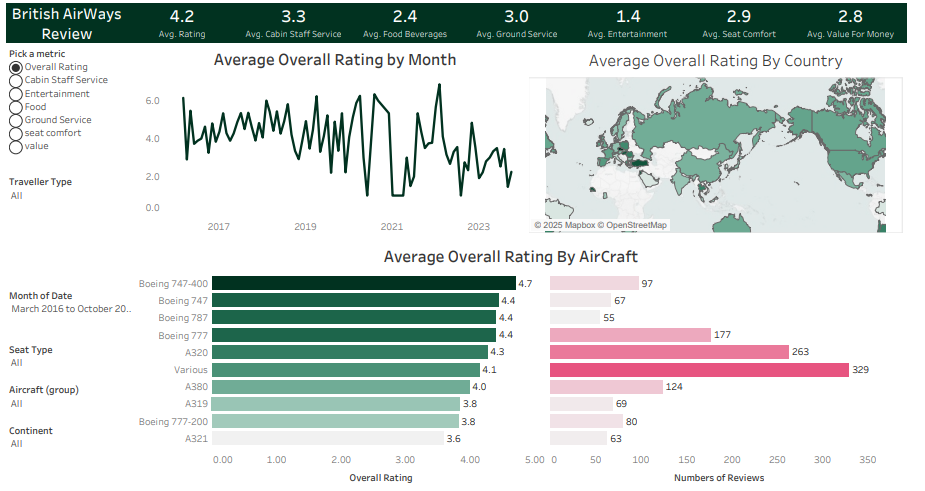

# British Airways Customer Feedback Dashboard (Tableau)

## Description  
A Tableau dashboard analyzing customer reviews of British Airways across categories like seat comfort, entertainment, cabin staff service, and overall satisfaction. Visualizes trends by aircraft type, month, and global ratings.

## Key Metrics  
- **Overall Avg Rating**: 4.2  
- **Top-Rated Categories**:  
  - Cabin Staff Service (3.3)  
  - Ground Service (3.0)  
  - Value for Money (2.8)  
- **Lowest-Rated Categories**:  
  - Entertainment (1.4)  
  - Food & Beverages (2.4)  

## Data Highlights  
- **Top Aircraft Ratings**:  
  - Boeing 747-400 (4.7)  
  - Boeing 787 (4.4)  
  - Boeing 777 (4.4)  
- **Monthly Trends**:  
  - Peak satisfaction in 2017, 2019, and 2021.  
- **Regional Insights**:  
  - Ratings by country (hover for details).  
- **Seat Type Analysis**:  
  - Ratings vary by seat class (Economy, Business, First).  

## Tools & Technologies  
- **Tableau Desktop** (Data Blending, Calculated Fields, Dashboards)  
- **Data Visualization**: Bar charts, maps, trend lines, filters  
- **Data Sources**: Customer review datasets, aircraft details  

## How to Use  
1. Open the `.twb` file in **Tableau Desktop** or **Tableau Public**.  
2. Use filters to explore ratings by aircraft type, month, or seat class.  
3. Hover over visuals for detailed breakdowns (e.g., country-specific ratings).  
